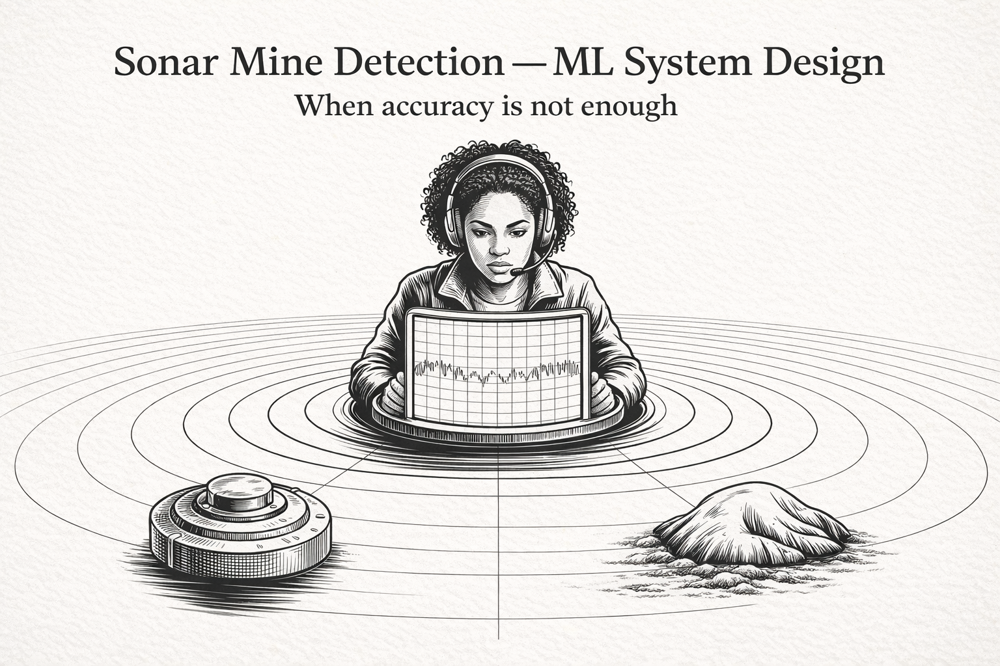

# Underwater mine detection using sonar signals

### Motivation

I'm drawn to problems where technical decisions and human factors intersect, particularly where standard approaches like optimising for accuracy miss the underlying business constraints. Having seen projects struggle from poor problem framing, I wanted to work through a complete ML development cycle on a dataset that forces careful thinking from the start.

  > SEEK motto  **"Do the right amount of thinking upfront."**

The sonar mine detection problem is ideal for this. It deals with asymmetric cost where missed mines are catastrophic but false alarms are manageable, making it a natural fit for exploring operator workload design and deployment considerations early in the process.

This project follows the ML development cycle closely from business problem framing to translation into clear ML objectives and deployment planning in the early design stages, to clearly capture what good looks like.

### Situation

Naval vessels need to distinguish between underwater mines and rocks on the seabed using active sonar. Sound waves bounce back as echoes that must be interpreted quickly. Miss a mine and you may lose the vessel and crew, flag too many false alarms and it becomes a nuisance to operators.

### Complication

This asymmetric cost makes it less of a vanilla classification problem. A missed mine is catastrophic whilst a false alarm is operationally manageable, meaning accuracy alone is insufficient as a success metric. The challenge is designing a system that handles this cost imbalance whilst remaining practical for operators to use.

### Solution

A tiered decision framework: high-confidence detections are automatically flagged as mines, very low-confidence readings dismissed as rocks, and uncertain cases sent for human review. This respects operator capacity whilst ensuring every genuine threat gets attention, we want to avoid overwhelming an operator with volume so they should only be called upon to review decisions on non-trivial cases.

Success means recall approaching 100 per cent (targeting 98 per cent or better on test data) and precision above 70 per cent to maintain operator trust.

### Production perspective

Beyond model performance, this project will demonstrate an end-to-end ML workflow. The final model is exposed as a containerised API designed to accept sonar signal arrays (60 frequency bands) and return classification probabilities with confidence scores, enabling integration into operational detection pipelines.

### Acknowledgements

Dataset from the UCI Machine Learning Repository, originally published by Gorman and Sejnowski (1988).

### Author
Adama Abanteriba Richards | [Portfolio](https://github.com/Thrawn6595/Portfolio-submarine-sonar)

---

MIT Licence
